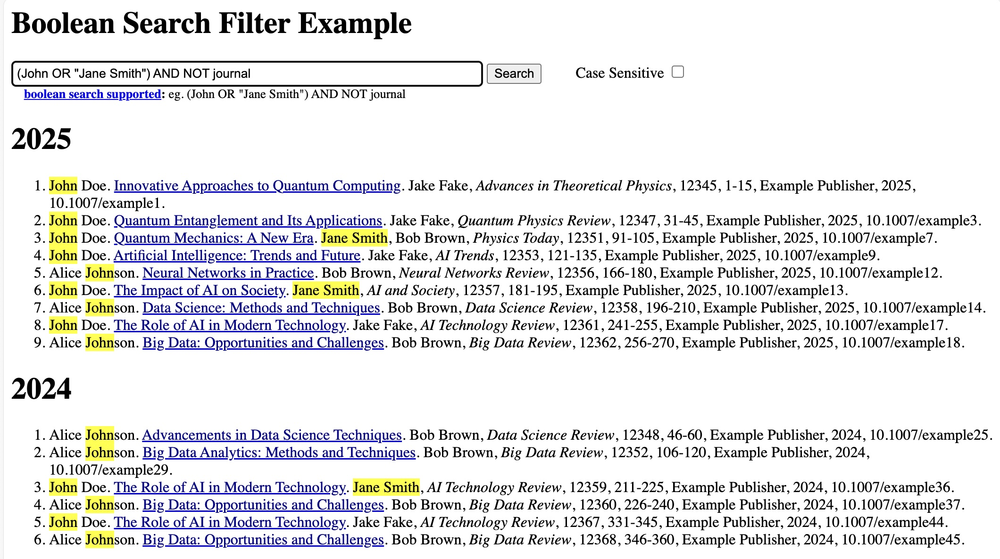

# Boolean search filter

Library to create a search form on a `HTML` page to search items using a boolean
expression of words, making none-matched items hidden, and making the searched words
highlighted in the matched items. Matching of the words in the boolean expression can
with a checkbox be done either case sensitive or case insensitive.

Below image shows the boolean search filter library in action. You can also see the
library directly in action look at the following
[url](https://raw.githack.com/harcokuppens/boolean-search-filter/ac1f976ebc9feac38f76909d952ef25e6996775e/example/index.html).
The source code of this example is at the subfolder `./example/`.



## Table of contents

<!--ts-->
<!-- prettier-ignore -->
   * [Description](#description)
   * [Online example](#online-example)
   * [Boolean expression](#boolean-expression)
   * [Usage](#usage)
      * [1. Use in a typescript project using which uses lib as dependency.](#1-use-in-a-typescript-project-using-which-uses-lib-as-dependency)
      * [2. Use in HTML page directly using bundled lib.](#2-use-in-html-page-directly-using-bundled-lib)
         * [Example webpage](#example-webpage)
         * [BooleanSearch with an autoform](#booleansearch-with-an-autoform)
         * [BooleanSearch with an self supplied form](#booleansearch-with-an-self-supplied-form)
            * [Static form in HTML](#static-form-in-html)
            * [Dynamically loaded form in javascript](#dynamically-loaded-form-in-javascript)
   * [Installation](#installation)
   * [API of the BooleanSearch Class](#api-of-the-booleansearch-class)
      * [Methods](#methods)
         * [setId(id: string)](#setidid-string)
         * [setAutoForm(subscript?: string)](#setautoformsubscript-string)
         * [setForm(formString: string)](#setformformstring-string)
         * [setElementsCssSelector(elementsCssSelector: string)](#setelementscssselectorelementscssselector-string)
         * [setSectionElementsCssSelector(sectionElementsCssSelector: string)](#setsectionelementscssselectorsectionelementscssselector-string)
         * [setHighlighting(active: boolean)](#sethighlightingactive-boolean)
         * [setHtmlPageSpecificFilterAndMarkCallback(callback: (fn: BooleanSearch.filterAndMarkElementsFunc) =&gt; boolean)](#sethtmlpagespecificfilterandmarkcallbackcallback-fn-booleansearchfilterandmarkelementsfunc--boolean)
         * [apply()](#apply)
<!--te-->

## Description

On websites listing many items one sometimes wants to filter the items listed. This
project adds a searchbox to your webpage in which you can type a boolean expression
with some search words to filter the items listed.

The boolean search filter searchbox uses the
[boolean expression library](https://github.com/harcokuppens/boolean-expression) in
typescript to evaluate a boolean expression with words on a give text. The matched
items after filtering will then be shown with the search words highlighted.
Highlighting is done with the
[hightlight words library](https://github.com/harcokuppens/highlight-words).

## Online example

To see the boolean search filter library directly in action look at the following
[url](https://raw.githack.com/harcokuppens/boolean-search-filter/ac1f976ebc9feac38f76909d952ef25e6996775e/example/index.html).
The source code of this example is at the subfolder `./example/`.

## Boolean expression

A boolean expressions is an expression where you combine search words with
parentheses and the NOT, AND and OR operators. For example we could write:

Example:

```
   (John OR "Jane Smith") AND NOT journal
```

When evaluating this expression against a given string, then each word in the
expression is match against the given string and in case of match replaced by `TRUE`
and else by `FALSE` in the string. The rewritten boolean expression can then easily
be evaluated to either `TRUE` or `FALSE`.

The boolean expression is applied to each item, and when `TRUE` the item is selected
to be shown in html, and when `FALSE` the item is hidden in html, causing only `TRUE`
items to be shown.

The [boolean expression library](https://github.com/harcokuppens/boolean-expression)
allows the boolean operators 'AND', 'OR' and 'NOT' to be used case insensitive and
also provides us with alternative words for the operators:

```
    operator  |    allowed syntax
  -----------------------------------
     AND      |  'AND', '&&', or '&'
     OR       |  'OR', '||', or '|'
     NOT      |  'NOT', or '!'
```

Meaning we can write the boolean expression in above example also as:

```
   (John | "Jane Smith") & !journal
```

Note that none-quoted words in the booleanexpression may not contain the characters
'|','&' and '!'. But if you quote the word then these characters are allowed. This
means that in above example '!journal' is read as 'NOT journal'.

As a convenience, when we omit an operator between words, then implicitly the 'AND'
operator is assumed.

Finally when we have an invalid boolean expression, eg. 'John AND', then an error
message 'Error in boolean search term' is displayed.

## Usage

Their are two ways you can use the BooleanSearch library. The first way is use the
library in a typescript project. The second way is to use the bundled version of the
library to directly use it in a `HTML` file. The first way we briefly discuss and
then give you an example. The second way we discuss in more detail to clearly show
how the library can be used.

### 1. Use in a typescript project using which uses lib as dependency.

We can create with `npm` an typescript project which adds the `boolean-search-filter`
library as a library dependency. In the project's `main.ts` script we import the
`boolean-search-filter` library and apply it to the `index.html` file. When deploying
the project we use `vite` to transpile all typescript code to a single javascript
bundle. The `vite` tool also modifies the deployed `index.html` to load this
javascript bundle. Then for deploying this application we only need to put the
`index.html` and its corresponding javascript bundle to the webserver. An example of
such a project is in the subfolder `usage/using_npm_lib_bundled_with_deps_by_vite/`.

### 2. Use in `HTML` page directly using bundled lib.

We first show an example `HTML` page and then show how to enable `Boolean search` on
it using with either an automatically applied form by the library or by a
self-supplied form. The source code of these examples are in the subfolder
`usage/using_bundled_lib/`.

#### Example webpage

We show it with an example where we have a webpage listing publications. The
publications are show in a list per year(section). The library also supports also
simple lists, but if you understand the sectioned lists example, then you will also
to be able to apply the library to simple lists. Therefore we do not give a simple
list example to keep documentation short.

```html
<html>

  <body>
    <h1>Boolean Search Filter Example</h1>

    <div id="mycontent">
      <h1>2025</h1>
      <ol>
        <li>
          publication 1
        </li>
        <li>
         publication 2
        </li>
      <ol>
      <h1>2024</h1>
      <ol>
        <li>
          publication 3
        </li>
        <li>
          publication 4
        </li>
      <ol>
      ...
    </div>
  </body>
</html>
```

#### BooleanSearch with an autoform

We can the add a boolean search form to this webpage by adding
`<div id="mybooleansearch"></div>` in the webpage where the search form should be
located, and then add javascript code to **auto**matically load the search **form**
at that `div` tag. This javascript code specifies using a CSS selector
`#mycontent > h1` at which tags the sections are, and a CSS selector `li` to specify
the elements within that section.

```html
<html>
  <script type="module">
    import { BooleanSearch } from "./BooleanSearch.bundled.es.js";
    new BooleanSearch()
      .setSectionElementsCssSelector("#mycontent > h1")
      .setElementsCssSelector("li")
      .setId("mybooleansearch")
      .setAutoForm()
      .apply();
  </script>

  <body>
    <h1>Boolean Search Filter Example</h1>

    <div id="mybooleansearch"></div>

    <div id="mycontent">
      <h1>2025</h1>
      <ol>
        <li>
          John Doe.
          ...
        <li>
         ...
      <ol>
      <h1>2024</h1>
      ...
    </div>
  </body>
</html>
```

The source code of these examples are in the subfolder `usage/using_bundled_lib/`.

#### BooleanSearch with an self supplied form

##### Static form in HTML

The simplest way to have self supplied form is to just put it in the `HTML` page.

```html
<html>
  <script type="module">
    import { BooleanSearch } from "./BooleanSearch.bundled.es.js";
    new BooleanSearch()
      .setSectionElementsCssSelector("#mycontent > h1")
      .setElementsCssSelector("li")
      .setId("BooleanSearch") // this call can be ommitted because this is the default id of the library
      .apply();
  </script>

  <body>
    <h1>Boolean Search Filter Example</h1>

    <div id="BooleanSearch">
    <form id="BooleanSearch_searchForm">
      <input id="BooleanSearch_searchbox" type="text" aria-label="Search text" />
      <button id="BooleanSearch_button" type="button" aria-label="Do Search">
        Search
      </button>
    </form>
    <div id="BooleanSearch_error" style="color: red; font-weight: bold"></div>
    <div id="BooleanSearch_answer"></div>
    </div>

    <div id="mycontent">
      <h1>2025</h1>
      <ol>
        <li>
          John Doe.
          ...
        <li>
         ...
      <ol>
      <h1>2024</h1>
      ...
    </div>
  </body>
</html>
```

The source code of these examples are in the subfolder `usage/using_bundled_lib/`.

##### Dynamically loaded form in javascript

You can also have an `HTML` form defined in a javascript variable `formString` and
call the `setForm(formString)` method on the BooleanSearch object to load the form in
the page dynamically.

```html
<html>
  <script type="module">
    import { BooleanSearch } from "./BooleanSearch.bundled.es.js";

    const customId = "mybooleansearch";
    const formString = `
      <b> customform </b>
      <form id="${customId}_searchForm">
         <input id="${customId}_searchbox" type="text" aria-label="Search text" />
         <button id="${customId}_button" type="button" aria-label="Do Search">
         Search
         </button>
      </form>
      <div id="${customId}_error" style="color: red; font-weight: bold"></div>
      <div id="${customId}_answer"></div>
    `;

    new BooleanSearch()
      .setSectionElementsCssSelector("#mycontent > h1")
      .setElementsCssSelector("li")
      .setId(customId)
      .setForm(formString)
      .apply();
  </script>

  <body>
    <h1>Boolean Search Filter Example</h1>

    <div id="mybooleansearch"></div>

    <div id="mycontent">
      <h1>2025</h1>
      <ol>
        <li>
          John Doe.
          ...
        <li>
         ...
      <ol>
      <h1>2024</h1>
      ...
    </div>
  </body>
</html>
```

The source code of these examples are in the subfolder `usage/using_bundled_lib/`.

## Installation

The bundled library can be download from the github projects releases page.

When using the project in a typescript project you can install it easily with `npm`
using the command:

```
npm install boolean-search-filter
```

## API of the BooleanSearch Class

The `BooleanSearch` class provides methods to set up and manage a boolean search
functionality on an HTML page. It allows setting up search forms, defining CSS
selectors for elements to be searched, and applying boolean search filters with
optional highlighting of matched elements.

The `BooleanSearch` class implements a
[fluent interface](https://en.wikipedia.org/wiki/Fluent_interface) which allows you
to chain method calls on the `BooleanSearch` object for convenient configuration.

Example of use of fluent interface:

```typescript
import { BooleanSearch } from "./BooleanSearch.bundled.es.js";
new BooleanSearch()
  .setSectionElementsCssSelector("#mycontent > h1")
  .setElementsCssSelector("li")
  .setId("mybooleansearch")
  .setAutoForm()
  .apply();
```

### Methods

#### `setId(id: string)`

Sets the ID of the HTML element where the search form will be inserted.

**Parameters:**

- `id` (`string`): The ID of the HTML element.

**Returns:**

- `this`: The current instance of `BooleanSearch`.

#### `setAutoForm(subscript?: string)`

Sets the auto-generated search form in the HTML element with the specified ID.

**Parameters:**

- `subscript` (`string`): Optional parameter to give a HTML string for a custom
  subscript below the automatically added form.

**Returns:**

- `this`: The current instance of `BooleanSearch`.

#### `setForm(formString: string)`

Sets a custom search form in the HTML element with the specified ID.

**Parameters:**

- `formString` (`string`): The HTML string for the custom search form.

**Returns:**

- `this`: The current instance of `BooleanSearch`.

#### `setElementsCssSelector(elementsCssSelector: string)`

Sets the CSS selector for the elements to be searched.

**Parameters:**

- `sectionElementsCssSelector` (`string`): The CSS selector for the elements.

**Returns:**

- `this`: The current instance of `BooleanSearch`.

#### `setSectionElementsCssSelector(sectionElementsCssSelector: string)`

Sets the CSS selector for the section elements to be searched. If this method is
called then we have multiple lists, one per section, where sections are selected by
the `sectionElementsCssSelector`, and elements within the section with the
`elementsCssSelector`. When this method is not called the library only uses the
`elementsCssSelector` for a single list of elements without any sections.

**Parameters:**

- `sectionElementsCssSelector` (`string`): The CSS selector for the section elements.

**Returns:**

- `this`: The current instance of `BooleanSearch`.

#### `setHighlighting(active: boolean)`

Enables or disables highlighting of matched elements.

**Parameters:**

- `active` (`boolean`): Whether highlighting should be active.

**Returns:**

- `this`: The current instance of `BooleanSearch`.

#### `setHtmlPageSpecificFilterAndMarkCallback(callback: (fn: BooleanSearch.filterAndMarkElementsFunc) => boolean)`

Sets a callback function for filtering and marking elements on the HTML page.

Internally in the library two of such callbacks are defined. One for filtering a
simple list with `elementsCssSelector`. and one for a nested listed in sections with
the `elementsCssSelector`.

If you have a more specific case of elements scattered over the webpage you can use
this function to write a custom callback the find each list and filter it with the
`filterAndMarkElementsFunc` function given to the callback. It is advised to look in
the BooleanSearch source code to get an idea how this works.

**Parameters:**

- `callback` (`(fn: BooleanSearch.filterAndMarkElementsFunc) => boolean`): The
  callback function.

**Returns:**

- `this`: The current instance of `BooleanSearch`.

#### `apply()`

Applies the search functionality to the HTML page.
